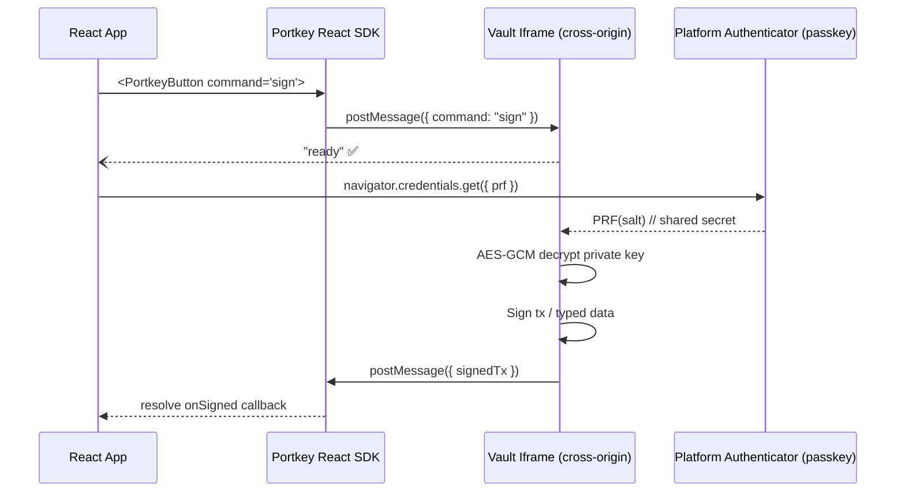

# Portkey 🔑🚪  
_Create passkey-secured, self-custodial crypto wallets & sign transactions straight from the browser._

[](https://www.npmjs.com/package/portkey-client)
[](https://bundlephobia.com/result?p=portkey-client)
[](./LICENSE)

Portkey brings the power of **FIDO2 / WebAuthn passkeys** to web3. Portkey uses Passkeys PRF extension to encrypt and decrypt keys for signing.
Think **Turnkey**, but without a third-party HSM: the private key _never leaves the user’s device_ and is never decryptable by your app, browser extensions, or Portkey itself.

---

## ✨ Highlights

| Feature | Description |
|---------|-------------|
| 🔒 **Isolated signing environment** | A cross-origin, CSP-locked iframe (“Vault”) handles all key material & cryptography. |
| 🪪 **Passkey PRF encryption** | Private keys are encrypted with the WebAuthn **PRF extension**; only the user’s passkey can decrypt. |
| 🏡 **Self-hosted Vault** | Deploy the Vault on your own sub-domain → no vendor lock-in, phishing-resistant, CSP-hardened. |
| 🧩 **React-first API** | `<BackgroundIframeProvider />`, ready-made `<PortkeyButton />`, and `usePortkeyWatcher()` hook. |
| 🌐 **All chains supported** | Ethereum (raw & EIP-712), Solana, Hyperliquid, and easy extensibility. |
| ⚡️ **Session re-use** | _Optional_ `allowSessionSigning` flag caches the derived AES key in a closure for ~5 min → multiple signatures without additional passkey prompts. |
| 🕶 **Zero snooping** | Vault lives in a different origin + sandboxed + `document.domain` locked. You can’t read it—even in devtools. |

---

## 🏗 Architecture



Cross-origin isolation prevents the parent from touching `VAULT.document`.

PRF extension = deterministic, credential-scoped HKDF; no user secrets cross domain.

Optional session key (in-memory, AES-encrypted) reduces UX friction.

## ❤️ Acknowledgements

- `ethers.js` & `@solana/web3.js` for crypto
- Design inspired by Turnkey

> “The best password is no password” → the best wallet is no seed phrase.  
> Welcome to passkey-powered web3 with **Portkey**.

---

## 🚀 Quick Start

### 1. Install

```bash
npm i portkey-client        # or pnpm add / yarn add
```

### 2. Wrap your app

```tsx
import React from "react";
import { BackgroundIframeProvider } from "portkey-client";

export default function App() {
  return (
    <BackgroundIframeProvider initialSrc="https://vault.yourapp.xyz">
      <YourRoutesAndPages />
    </BackgroundIframeProvider>
  );
}
```

### 3. Create a wallet (signup)

```tsx
import { PortkeyButton } from "portkey-client";

export function Signup() {
  return (
    <PortkeyButton
      label="Create Wallet"
      command="signup"
      buttonType="signup"
      origin="https://vault.yourapp.xyz"
      className="my-4"
    />
  );
}
```

PortkeyButton automatically:

Moves and shows the Vault iframe on top of itself.

Sends the signup command.

Waits for the Vault to return { wallet, passkey }.

### 4. Listen for results

```tsx
import { usePortkeyWatcher } from "portkey-client";

export function GlobalPortkeyEvents() {
  usePortkeyWatcher((msg) => {
    if (msg.command === "signup" && msg.result) {
      console.log("✅ New wallet:", msg.result.wallet);
      // ➡️ Persist `wallet.cipherText / iv / salt` server-side
    }
  }, "https://vault.yourapp.xyz");

  return null; // invisible listener
}
```

### 5. Sign a transaction

```tsx
import {
  signEthereumTransaction,
  signSolanaTransaction,
} from "portkey-client";

export async function doSomethingCool({
  iframe,         // from BackgroundIframeContext
  vaultOrigin,    // https://vault.yourapp.xyz
  vault,          // { cipherText, iv, salt } from step 3
  pubkey,         // passkey credentialId
}) {
  signEthereumTransaction({
    iframe,
    vaultOrigin,
    pubkey,
    vault,
    transaction: btoa(
      JSON.stringify({
        to: "0x11a1f109551bD432803012645Ac136ddd64DBA72",
        value: "0x2386f26fc10000", // 0.01 ETH
        maxFeePerGas: "0x28",
        maxPriorityFeePerGas: "0x28",
        nonce: 0,
        chainId: 1,
        type: 2,
      })
    ),
    onSigned: (rawTx) => console.log("📜 signedTx:", rawTx),
    onError: console.error,
  });
}
```

---

## 🛠 API Reference

<details>
<summary><strong>&lt;BackgroundIframeProvider initialSrc?&gt;</strong></summary>

| Prop        | Type       | Default       | Description                      |
|-------------|------------|---------------|----------------------------------|
| initialSrc  | string     | "about:blank" | The Vault URL                   |
| children    | ReactNode  | —             | Your app content                |

Exposes context:

```ts
{
  iframeRef: RefObject<HTMLIFrameElement>;
  setIframeSrc(src: string): void;
  moveIframeTo(el: HTMLElement | null): void;
}
```
</details>

<details>
<summary><strong>&lt;PortkeyButton /&gt;</strong> (UI helper)</summary>

| Prop        | Type                               | Required | Description                                |
|-------------|------------------------------------|----------|--------------------------------------------|
| label       | string                             | ✔︎       | Button text                                 |
| buttonType  | "signup" \| "signEthTx" \| "signSolTx" | ✔︎       | What to do on click                         |
| command     | string                             | ✔︎       | Command sent to iframe                      |
| origin      | string                             | ✔︎       | Vault origin (e.g. https://vault.foo.xyz)   |
| data        | Record<string, any>                | —        | Optional payload                            |
| hide        | boolean                            | —        | Render invisible, iframe stays alive        |

</details>

<details>
<summary><strong>createWallet(options)</strong></summary>

```ts
createWallet({
  iframe,
  vaultOrigin,
  jwt,
  pubkey,
  onResult(wallet),
  onError(error),
});
```

Creates both an Ethereum & Solana wallet encrypted with the passkey PRF.

</details>

<details>
<summary><strong>signEthereumTransaction(options)</strong></summary>

Same signature as above, plus `transactionBase64`.  
Returns `{ signedTx }`.

</details>

<details>
<summary><strong>signSolanaTransaction(options)</strong></summary>

Same signature as above, plus `transactionBase64`.  
Returns `{ signedTx }` (Base64 of a `VersionedTransaction`).

</details>

<details>
<summary><strong>usePortkeyWatcher(handler, allowedOrigin)</strong></summary>

```ts
usePortkeyWatcher((msg) => {
  // msg.command === "signup", "signedEthereumTransaction", etc.
}, "https://vault.foo.xyz");
```

Typed guard for `window.postMessage` events.

</details>

---

## ⚙️ Advanced

### Keep-alive session key

```ts
{ allowSessionSigning: true } // default: false
```

- Derives AES key once
- Re-encrypts it in memory
- Auto-expires after 5 min of inactivity

### Custom UI (no preset button)

```tsx
const { iframeRef, setIframeSrc, moveIframeTo } = useBackgroundIframe();

function MyBeautifulCTA() {
  const ref = React.useRef<HTMLButtonElement>(null);

  const onClick = () => {
    if (!ref.current) return;
    setIframeSrc("https://vault.foo.xyz?chain=eth");
    moveIframeTo(ref.current);

    iframeRef.current?.contentWindow?.postMessage(
      { command: "signEthereumTransaction", data: myTx },
      "https://vault.foo.xyz"
    );
  };

  return <button ref={ref} onClick={onClick}>Pay 0.01 ETH</button>;
}
```

---

## 🛡 Security Model

- **Origin Isolation**: Vault is served from `vault.yourapp.xyz`, while your app runs on `app.yourapp.xyz`.
- **CSP hardened**: Scripts only allowed from trusted CDNs.
- **Access-blocked iframe**: `document.domain` and top access disabled.
- **PRF-based key derivation**: No brute-force vector; passkey is required.
- **No remote logging**: All logs stay inside the Vault iframe.

See `vault/index.html` for CSP, COOP/COEP, and nonce usage.

---

## 🏗 Deploying the Vault

```bash
cd packages/vault
pnpm build
rsync -a dist/ user@server:/var/www/vault
```

DNS → `vault.yourapp.xyz`, HTTPS required.

Add these headers:

```
Cross-Origin-Opener-Policy: same-origin
Cross-Origin-Embedder-Policy: require-corp
Content-Security-Policy: default-src 'self';
```

---

## 🧑‍💻 Contributing

```bash
pnpm i
pnpm dev  # runs Storybook + local Vault server
```

Use Conventional Commits. See `/CONTRIBUTING.md`.

---

## 📄 License

MIT © Your Company Name – Use at your own risk. Experimental software; audit pending.

---

